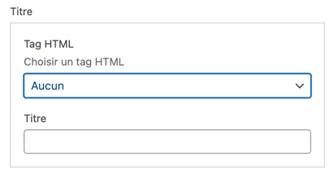
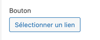
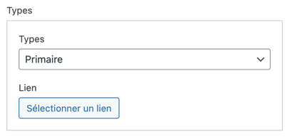
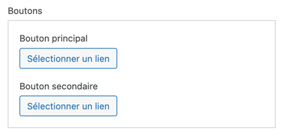
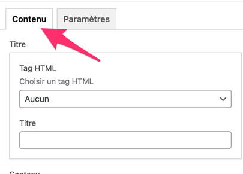
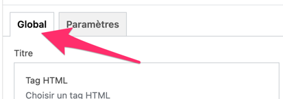
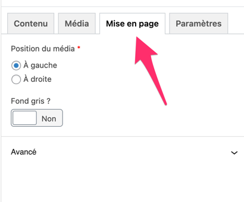
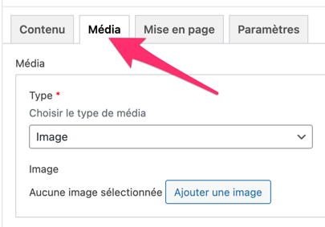
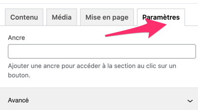
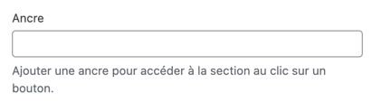

# Fields Helper

- [Buttons](#buttons)
- [Choice](#choice)
- [Layout](#layout)
- [Medias](#medias)
- [Settings](#settings)
- [Tabs](#tabs)
- [Typography](#typography)

## Contexte & usage
Nous nous sommes rendus compte que nous utilisions toujours les mêmes types de champs ou groupe de champs.
Le nommage des **clés** était redondant et l'écriture du TWIG également.

Nous avons donc créé un helper pour simplifier l'écriture des champs et des groupes de champs.

Ainsi, cela facilite aussi l'inclusion des fichiers twig sans en évident de devoir passer toujours les mêmes paramètres. On pourra donc définitir des valeurs de clés par défaut dans nos composants twig.

Cela permet aussi de faciliter les options des champs que l'on rentre systématiquement, comme par exemple :
```php
TrueFalse::make('Social Media', 'display_social_media')
->stylisedUi()
```

Cela permet aussi d'avoir une maintenance de champs plus globale. Si nous devons effectuer une modification sur un champ, cela se fera partout.

Chaque classe étend des champs ACF de https://github.com/vinkla/extended-acf.

Cela permet de pouvoir utiliser les méthodes de base des champs ACF, mais aussi d'avoir des méthodes supplémentaires.

**Exemple :**
```php
TextField::make()
    ->instructions('Add the employees name.')
    ->characterLimit(100)
    ->required();
```

## Typography

### HeadingField

**Heading** - Champ titre

```php
use Adeliom\Lumberjack\Admin\Fields\Typography;

HeadingField::make(?string $label = "Titre", ?string $name = "title");

// Champs groupés (Titre + HTML tag)
HeadingField::make()
    ->tag(?array $choices = [], ?string $instructions = "Choisir un tag HTML");
```



### IconField

**Icon** - Champ icône

```php
use Adeliom\Lumberjack\Admin\Fields\Typography;

IconField::make(?string $label = "Icône", ?string $name = "icon");
```

### TextAreaField

**Textarea** - Champ textarea

```php
use Adeliom\Lumberjack\Admin\Fields\Typography;

TextareaField::make(?string $label = "Description", ?string|null $name = "description");
```


### TextField

**Text** - Champ texte simple

```php
use Adeliom\Lumberjack\Admin\Fields\Typography;

TextField::make(?string $label = "Contenu", ?string $name = "Contenu");
```

### UptitleField

**UpTitle** - Champ sur-titre simple

```php
use Adeliom\Lumberjack\Admin\Fields\Typography;

UptitleField::make(?string $label = "Sur-titre", ?string|null $name = "uptitle");
```

### WysiwygField
**Wysiwyg** - Champ wysiwyg

```php
use Adeliom\Lumberjack\Admin\Fields\Typography;

WysiwygField::make(?string $label = "Description", ?string|null $name = "wysiwyg");

WysiwygField::make()->simple(); // Toolbar simple = bold, italic, underline...
WysiwygField::make()->default(); // Toolbar complète = gestion des formats et des styles
```

## Buttons
### ButtonField

```php
use Adeliom\Lumberjack\Admin\Fields\Buttons;

// Arguments par défault
ButtonField::make(?string $label = "Bouton", string|null $name = "button");
```

```php
//Basic usage
ButtonField::make();
```

```php
//Options de type
ButtonField::make()->types();
```

```php
//Options de groupe
ButtonField::make()->group();
```


## Choices

### CheckboxField

**Checkbox** - Champ de choix, aucun argument par défaut
```php
use Adeliom\Lumberjack\Admin\Fields\Choices;

CheckboxField::make(?string $label = "", ?string|null $name = "")

//Basic usage
CheckboxField::make();
```

### RadioField

**Radio** - Champ de choix, aucun argument par défaut
```php
use Adeliom\Lumberjack\Admin\Fields\Choices;

RadioField::make(?string $label = "", ?string|null $name = "")

//Basic usage
RadioField::make();
```

### SelectField

**Select** - Champ de choix, aucun argument par défaut
```php
use Adeliom\Lumberjack\Admin\Fields\Choices;

SelectField::make(?string $label = "", ?string|null $name = "")

//Basic usage
SelectField::make();
```

### TrueFalseField

**TrueFalse** - Champ vrai/faux

```php
use Adeliom\Lumberjack\Admin\Fields\Choices;

TrueFalseField::make(?string $label = "", ?string|null $name = "")
    ->stylisedUi(); //par défaut

//Basic usage
TrueFalseField::make();
```

## Medias

### FileField
**File** - Champ upload de fichiers

```php
use Adeliom\Lumberjack\Admin\Fields\Medias;

FileField::make(?string $label = "Fichier", ?string|null $name = "file");

FileField::make()->pdf();
```
### GalleryField
@TODO


### ImageField
**Image** - Champ image

```php
use Adeliom\Lumberjack\Admin\Fields\Medias;

ImageField::make(?string $label = "Image", ?string|null $name = "image");

ImageField::make()->ratio(int $width = null, int $height = null); // Instructions pour un ratio
```

### VideoField
**Vidéo** - Champ vidéo (gestion de la thumbnail, vidéo mp4 ou ID youtube)

```php
use Adeliom\Lumberjack\Admin\Fields\Medias;

VideoField::make();
```

### MediaField
**Média** - Champ média (choix entre image ou vidéo)

```php
use Adeliom\Lumberjack\Admin\Fields\Medias;

MediaField::make(string $instructions = "", array $includes = ["image", "video"]);
```

## Relations

### PostField
**Post** - Champ relationnel

```php
use Adeliom\Lumberjack\Admin\Fields\Relations;

PostField::make(?string $label = "Page", ?string|null $name = "post")
            ->returnFormat('object') //default
            ->allowNull(); //default

//Basic usage
PostField::make();
```

### RelationField
**Relationship** - Champ relationnel

```php
use Adeliom\Lumberjack\Admin\Fields\Relations;

RelationField::make(?string $label = "Page", ?string|null $name = "post")
            ->returnFormat('object') //default
            ->allowNull(); //default

//Basic usage
RelationField::make();
```

### TaxonomyField
**Taxonomy** - Champ relationnel d'une taxonomy

```php
use Adeliom\Lumberjack\Admin\Fields\Relations;

TaxonomyField::make(?string $label = "Catégorie", ?string|null $name = "category")
        ->addTerm(false) //default
        ->loadTerms(false) //default
        ->saveTerms(true) //default
        ->appearance('select') //default
        ->returnFormat('object'); //default

//Basic usage
TaxonomyField::make();
```

## Tabs
**Usage** - Usage global à l'ensemble des champs "onglet"
```php
use Adeliom\Lumberjack\Admin\Fields\Tabs;

ContentTab::make()->fields([
    TextField::make(),
    TextareaField::make()
]);
```

### ContentTab
**ContentTab** - Champs onglet pour le contenu standard

```php
use Adeliom\Lumberjack\Admin\Fields\Tabs;

ContentTab::make(?string $label = "Contenu", ?string|null $name = "content_tab");

//exemple
ContentTab::make()->fields([
    HeadingField::make(),
    WysiwygField::make()->default(),
]);
```



### GlobalTab
**GlobalTab** - Champs onglet pour le contenu global

```php
use Adeliom\Lumberjack\Admin\Fields\Tabs;

GlobalTab::make(?string $label = "Global", ?string|null $name = "global_tab");

//exemple
GlobalTab::make()->fields([
    TextField::make(),
]);
```



### LayoutTab
**LayoutTab** - Champs onglet pour la gestion de la mise en page (ex: position média, suppression des marges...)

```php
use Adeliom\Lumberjack\Admin\Fields\Tabs;

LayoutTab::make(?string $label = "Mise en page", ?string|null $name = "layout_tab");

//exemple
LayoutTab::make()->fields([
    LayoutField::mediaPosition(),
]);
```



### MediaTab
**MediaTab** - Champs onglet pour l'affichage des champs médias (media, image, video)

```php
use Adeliom\Lumberjack\Admin\Fields\Tabs;

MediaTab::make(?string $label = "Média", ?string|null $name = "media_tab");

//exemple
MediaTab::make()->fields([
    MediaField::make(),
]);
```



### SettingsTab
**SettingsTab** - Champs onglet pour la gestion des paramètres (ex: ancre/identifiant d'un bloc)

```php
use Adeliom\Lumberjack\Admin\Fields\Tabs;

SettingsTab::make(?string $label = "Paramètres", ?string|null $name = "settings_tab");

//exemple
SettingsTab::make()->fields([
    SettingsField::anchor(),
]);
```



### TabField
**Tab** - Champs onglet classique

```php
use Adeliom\Lumberjack\Admin\Fields\Tabs;

TabField::make(string $label = "", ?string|null $name = null);
```

## Layout

### LayoutField
```php
use Adeliom\Lumberjack\Admin\Fields\Layout;
```

**darkMode** - Champ vrai/faux pour activer/désactiver le dark mode sur une section ou une page

```php
LayoutField::darkMode();
```

**mediaPosition** - Champ select pour choisir la position du média (gauche/droite)

```php
LayoutField::mediaPositionarray($choices = [
        'left'   => 'À gauche',
        'right'  => 'À droite'
    ]);
```

**margin** - Groupe de champs pour gérer la taille des marges et la suppression de la marge haute et basse des blocs.

```php
LayoutField::margin(array $fields = [
        "sizes",
        "top_remove",
        "bottom_remove"
    ]);
```


## Settings

### SettingsField

**Settings** - Champs permettant d'ajouter des fonctionnalité global au bloc
```php
use Adeliom\Lumberjack\Admin\Fields\Settings;
```

**Anchor** - Champ texte pour ajouter une ancre sur un bloc
```php
SettingsField::anchor(?string $label = "Ancre", ?string|null $name = "anchor");

//Basic usage
SettingsField::anchor();
```

